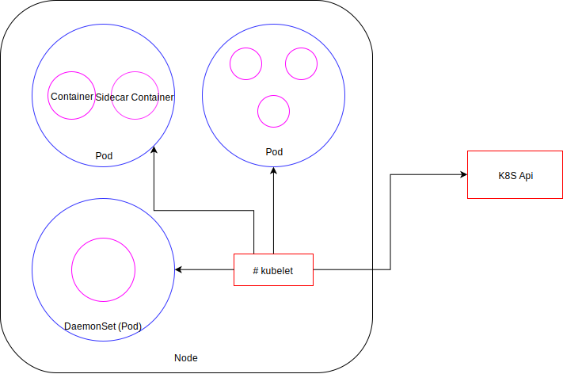
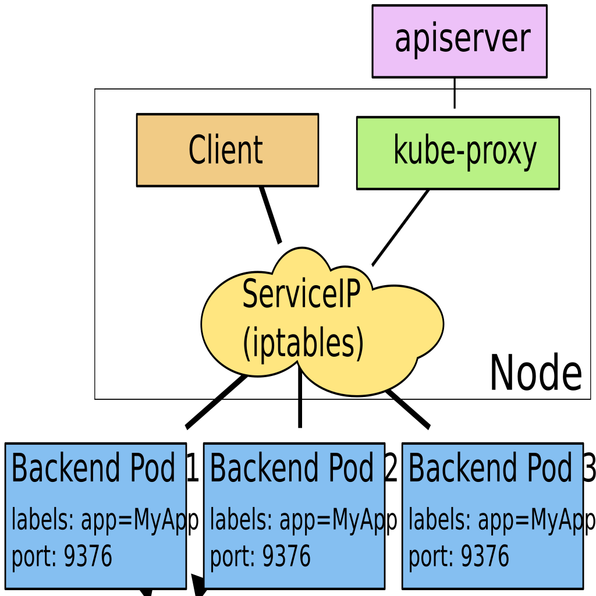

class: center, middle

# Kubernetes (aka k8s)

---

# Create Cluster

```sh
gcloud container clusters create --cluster-version 1.9.7-gke.0 test
Creating cluster test...done.
Created [https://container.googleapis.com/v1/projects/play-sandbox/zones/europe-west1-b/clusters/test].
kubeconfig entry generated for test.
NAME  LOCATION        MASTER_VERSION  MASTER_IP      MACHINE_TYPE   NODE_VERSION  NUM_NODES  STATUS
test  europe-west1-b  1.9.7-gke.0     23.251.128.26  n1-standard-1  1.9.7-gke.0   3          RUNNING

```

```sh
gcloud container clusters get-credentials MY-CLUSTER --zone europe-west1-d --project play-sandbox
kubectl get nodes
```

???

Cluster has already been created!
`gcloud container clusters get-credentials MY-CLUSTER` should be enough

---

# Intro to k8s

- `Deployment`
- `ConfigMap`
- `Secret`
- Volumes
- `Service`
- `Ingress`
- `livenessProbe` and `readinessProbe`
<!-- TODO -->
<!-- - PV/PVC/StatefulSet -->
- `DaemonSet`
- `Job`
- `CronJob`
- `HorizontalPodAutoscaler`
<!-- TODO -->
<!-- - Node/Pod Selection/Affinity -->
<!-- TODO -->
<!-- - RBAC -->
- `Namespace`
- Requests and Limits
- `NetworkPolicy`
- `CustomResourceDefinition`
- Reference Documentation and `apiVersion`
- Common Patterns
- Yaml Conventions
- Debug Tips
- Workshop

---

# What's on a Node?



???

DaemonSet is a special type of Pod (Deployment)

---

# `Deployment`

Manages the lifetime of your pods (Manages a `ReplicaSet` behind the scenes).

```yaml
apiVersion: apps/v1
kind: Deployment
metadata:
  name: hello-server
  labels:
    run: hello-server
spec:
  replicas: 3
  selector:
    matchLabels:
      run: hello-server
  template:
    metadata:
      labels:
        run: hello-server
    spec:
      containers:
      - image: gcr.io/google-samples/hello-app:1.0
        name: hello-server
        ports:
        - containerPort: 8080
          protocol: TCP
```

`spec.selector.matchLabels` must be satisfied by `spec.template.metadata.labels`.

???

`spec.template.spec.containers[].ports` is actually useless (afaik). It doesn't
block or allow network traffic to any port, nor does its absence forbids you to make services.
TODO have a trickier matchLabels example?

---

# Exercise - Create a `Deployment`

`kubectl` completion:
```sh
source <(kubectl completion zsh)
```

Create a `Deployment`:
```sh
kubectl run hello-server --image gcr.io/google-samples/hello-app:1.0 --port 8080
```

List the deployments:
```sh
kubectl get deployment
```

Get additional information on the `Deployment`:
```sh
kubectl describe deployment hello-server
```

List the pods and their corresponding nodes:
```sh
kubectl get pod -o wide
```

---

# Exercise - Expose a `Deployment`

Expose the `Deployment` (creates a `Service`):
```sh
kubectl expose deployment hello-server --type "LoadBalancer"
```

List the services:
```sh
kubectl get service
```

---

# Exercise - Scaling a `Deployment`

```sh
curl <service>
kubectl scale deployment hello-server --replicas=3
kubectl get pods
curl <service>
kubectl edit deployment hello-server # decrease the replicas field
curl <service>
```

???

They need to find out the ip:port of the service.
We should have seen this in the first workshop.

---

# `Deployment` - rollingUpdate

Update strategy of a `Deployment` object.
Based on 2 values:

* `maxUnavailable` k8s api defaults to 25% and kubectl defaults to 1
* `maxSurge` k8s api defaults to 25% and kubectl defaults to 1

```yaml
apiVersion: apps/v1
kind: Deployment
metadata:
  name: hello-server
  labels:
    run: hello-server
spec:
  replicas: 3
  selector:
    matchLabels:
      run: hello-server
* strategy:
*   rollingUpdate:
*     maxSurge: 1
*     maxUnavailable: 1
*   type: RollingUpdate
  template:
    metadata:
      labels:
        run: hello-server
[...]
```

???

Ask if they can see why the defaults can be problematic when replicas = 1

---

# Exercise - `Deployment` - Update image

Default maxUnavailable/maxSurge are lame when replicas is 1:

```sh
httping <service>
# 1 replicas / default maxunavailable
# Update with image that doesn't exist
kubectl set image deployment hello-server hello-server=gcr.io/google-samples/hello-app:1.1
# 2 replicas / default maxunavailable
# Update back with image hello-app:1.0 that exists
kubectl edit deployment hello-server # edit replicas field
```

---

# `ConfigMap`

Stores configuration.

```sh
kubectl create configmap fromliteral --from-literal=key=value
```

```yaml
apiVersion: v1
*data:
* key: value
kind: ConfigMap
metadata:
  name: fromliteral
```

```sh
kubectl create configmap fromfile --from-file=nginx.conf
```

```yaml
apiVersion: v1
*data:
* nginx.conf: |
*   server {
*
*   }
kind: ConfigMap
metadata:
  name: fromfile
```

???

We'll see in a moment how we can use this

---

# `Secret`

Meant to store secrets rather than just configuration.
Not much more features than `ConfigMap` for now.

```sh
kubectl create secret generic mytoken --from-file=token
```

```yaml
apiVersion: v1
data:
  token: U0VDUkVUX1RPS0VOCg==
kind: Secret
metadata:
  name: mytoken
type: Opaque
```

Differences with ConfigMap:
- Supports encryption at rest since 1.7

---

# `ConfigMap` or `Secret` as Env Vars

```yaml
apiVersion: extensions/v1beta1
kind: Deployment
metadata:
  name: envtest
spec:
  replicas: 1
  template:
    metadata:
      labels:
        name: envtest
    spec:
      containers:
      - name: envtest
        image: gcr.io/<PROJECT_ID>/envtest
        ports:
        - containerPort: 3000
        env:
        - name: LANGUAGE
          valueFrom:
            configMapKeyRef:
              name: language
              key: LANGUAGE
        - name: API_KEY
          valueFrom:
            secretKeyRef:
              name: apikey
              key: API_KEY
```

---

# Volumes

Mounts data into the containers.

```yaml
apiVersion: v1
kind: Pod
metadata:
  name: configmap-pod
spec:
  containers:
    - name: test
      image: busybox
      volumeMounts:
        - name: config-vol
          mountPath: /etc/config
  volumes:
    - name: config-vol
      configMap:
        name: log-config
        items:
          - key: log_level
            path: log_level
```

---

# Services

> A Kubernetes Service is an abstraction which defines a logical set of Pods and a policy by which to access them - sometimes called a micro-service. The set of Pods targeted by a Service is (usually) determined by a Label Selector.


Types:

* `ClusterIP`
* `NodePort`
* `LoadBalancer`
* `ExternalName`

Goal:

```sh
kubectl run something ... --expose
[... magic ...]
curl something
```

???

Definition from official documentation

---

# Services - `ClusterIP`

Exposes a Pod port inside the cluster.



---

# Services - `ClusterIP`


```yaml
apiVersion: v1
kind: Service
metadata:
  name: hello-server
spec:
  ports:
  - port: 9000
    protocol: TCP
    targetPort: 8080
  selector:
    run: hello-server
  type: ClusterIP
```

```sh
kubectl apply -f clusterip.yaml
```

```sh
kubectl get service
NAME                      TYPE        CLUSTER-IP      EXTERNAL-IP   PORT(S)          AGE
hello-server              ClusterIP   10.59.246.242   <none>        9000/TCP         10s
```

Traffic on 10.59.246.242:9000 will be redirected to the port 8080 of all the pods that carry the label `run: hello-server`.

---

# Services - `ClusterIP` - Exercise

Query the service from inside the cluster:
```sh
kubectl run debug --image=alpine -- /bin/sh -c 'sleep 10000'
kubectl exec -ti debug-XXX /bin/sh
```

```sh
alpine $ apk update ; apk add curl
alpine $ curl hello-server:9000
```

---

# Services - `NodePort`

Exposes a Pod port on a given port on each Nodes.
Automagically uses a `ClusterIP` behind the scenes.


---

# Services - `NodePort`

```yaml
apiVersion: v1
kind: Service
metadata:
  name: hello-server
spec:
  ports:
  - port: 9000
    protocol: TCP
    targetPort: 8080
  selector:
    run: hello-server
  type: NodePort
```

```sh
kubectl get service hello-server -o yaml
kubectl get service
NAME                      TYPE        CLUSTER-IP      EXTERNAL-IP   PORT(S)          AGE
hello-server              NodePort    10.59.243.61    <none>        9000:30037/TCP   10s
```

Traffic to all nodes' public ips on port 30037 will be redirected to the `ClusterIp` with ip 10.59.243.61 and port 9000 which will redirect traffic to the port 8080 of all the pods that carry the label `run: hello-server`.

---

# Services - `NodePort` - Exercise

```sh
kubectl delete service hello-server
kubectl apply -f service.yaml
kubectl get service
```

???

Give them the service.yaml manifest
TODO query from outside of cluster

---

# Services - `LoadBalancer`

Exposes a Pod port on an external LoadBalancer, usually a cloud provider.
Automagically uses a `NodePort` behind the scenes.


---

# Services - `LoadBalancer`


```yaml
apiVersion: v1
kind: Service
metadata:
  name: hello-server
spec:
  ports:
  - port: 9000
    protocol: TCP
    targetPort: 8080
  selector:
    run: hello-server
  type: LoadBalancer
```

```sh
kubectl get svc
NAME                        TYPE           CLUSTER-IP      EXTERNAL-IP   PORT(S)          AGE
hello-server                LoadBalancer   10.59.243.34    <pending>     9000:30360/TCP   6s
[...]
kubectl get svc
NAME                        TYPE           CLUSTER-IP      EXTERNAL-IP   PORT(S)          AGE
hello-server                LoadBalancer   10.59.243.34    35.195.44.77  9000:30360/TCP   1m
```

Traffic to 35.195.44.77:9000 will be redirected to the `NodePort` port 30360 which will redirect traffic to the `ClusterIp` with ip 10.59.243.34 and port 9000 which will redirect traffic to the port 8080 of all the pods that carry the label `run: hello-server`.

---

# Services - `LoadBalancer` - Exercise

```sh
vim service.yaml
kubectl apply -f service.yaml
kubectl get svc -w
curl ...
```

---

# Services - `ExternalName`

Alias for an external service.

```yaml
kind: Service
apiVersion: v1
metadata:
  name: managed-db-saas
spec:
  externalName: managed-db.saas.com
  type: ExternalName
```

```sh
pod $ host managed-db-saas
managed-db-saas.default.svc.cluster.local is an alias for managed-db.saas.com.
```

---

# `Ingress`

Exposes a `NodePort` on an L7 http(s) endpoint.

```yaml
apiVersion: extensions/v1beta1
kind: Ingress
metadata:
  name: test
  annotations:
    nginx.ingress.kubernetes.io/rewrite-target: /
spec:
  rules:
  - host: foo.bar.com
    http:
      paths:
      - path: /foo
        backend:
          serviceName: s1
          servicePort: 80
      - path: /bar
        backend:
          serviceName: s2
          servicePort: 80
```

```
foo.bar.com/foo -> s1:80/
foo.bar.com/bar -> s2:80/
```

---

# `Ingress` - Architecture

Multiple `Ingress` types exist, for example:

* GCE
* Haproxy
* Nginx
* Træfik

They all come with their own controller:

* https://github.com/kubernetes/ingress-gce
* https://github.com/appscode/voyager
* https://github.com/kubernetes/ingress-nginx
* https://github.com/containous/traefik/tree/master/examples/k8s

The controllers simply run in a Pod. For GCE the Pod(s?) run on the masters,
invisible to the user.

Example:

```sh
kubectl get pod -n kube-system
NAME                                                         READY     STATUS    RESTARTS   AGE
jxing-nginx-ingress-controller-547979cfb9-6sjs9              1/1       Running   0          22d
jxing-nginx-ingress-default-backend-6f4ff5fcbc-gx6k2         1/1       Running   0          22d
```

???

TODO show network architecture (LB > NodePort > Ingress-controller pod > nginx >
clusterIP)

---

# `Ingress` - Annotations


Use the annotation `kubernetes.io/ingress.class` to force an ingress controller.

Example:

```yaml
kind: Ingress
metadata:
  annotations:
    kubernetes.io/ingress.class: "nginx"
```
```yaml
kind: Ingress
metadata:
  annotations:
    kubernetes.io/ingress.class: "gce"
```

If you don't, all the ingress controllers will consider the `Ingress` object and
try to configure the ingress.

???

TODO more useful examples?

---

# `livenessProbe` and `readinessProbe`

The `livenessProbe` checks that the container is __alive__.

Long running applications sometimes break and stay broken. If the `livenessProbe`
fails the container is killed and restarted.

The `readinessProbe` checks that the container is __ready__.

A container could be up but not yet ready (think long starting application, or
pending db connections).
The `readinessProbe` is really important because it removes the container
endpoint from the service if it's not ready.

Probes can be a:

* Command inside the container
* HTTP GET
* TCP Connection

???

Ask if it is clear why not just the `readinessProbe`?
Possible Answer: We don't want to kill a pod just because it has lost its
connection to its db.

---

# `livenessProbe` and `readinessProbe` - Example

```yaml
readinessProbe:
  httpGet:
    path: /monitoring/ready
    port: 3401
  initialDelaySeconds: 5
  timeoutSeconds: 1
  periodSeconds: 15
livenessProbe:
  httpGet:
    path: /monitoring/alive
    port: 3401
  initialDelaySeconds: 15
  timeoutSeconds: 1
  periodSeconds: 15
```

---

# `DaemonSet`

A way to deploy a pod on all the nodes.

```yaml
apiVersion: apps/v1
kind: DaemonSet
metadata:
  name: fluentd-elasticsearch
spec:
  template:
    spec:
      containers:
      - name: fluentd-elasticsearch
        image: k8s.gcr.io/fluentd-elasticsearch:1.20
        volumeMounts:
        - name: varlog
          mountPath: /var/log
        - name: varlibdockercontainers
          mountPath: /var/lib/docker/containers
          readOnly: true
      volumes:
      - name: varlog
        hostPath:
          path: /var/log
      - name: varlibdockercontainers
        hostPath:
          path: /var/lib/docker/containers
```

---

# `Job`

One shot pods execution.

```yaml
apiVersion: batch/v1
kind: Job
metadata:
  name: pi
spec:
  template:
    spec:
      containers:
      - name: pi
        image: perl
        command: ["perl",  "-Mbignum=bpi", "-wle", "print bpi(2000)"]
      restartPolicy: Never
  backoffLimit: 4
```

```sh
$ kubectl get pods
NAME                                 READY     STATUS             RESTARTS   AGE
pi-9829x                             0/1       Completed          0          2m

$ kubectl get job
NAME      DESIRED   SUCCESSFUL   AGE
pi        1         1            3m
```

---

# `CronJob`

Scheduled `Job`s

```yaml
apiVersion: batch/v1beta1
kind: CronJob
metadata:
  name: hello
spec:
  schedule: "*/1 * * * *"
  jobTemplate:
    spec:
      template:
        spec:
          containers:
          - name: hello
            image: busybox
            args:
            - /bin/sh
            - -c
            - date; echo Hello from the Kubernetes cluster
          restartPolicy: OnFailure
```

---

# `HorizontalPodAutoscaler`

Scales a `Deployment` based on a metric (checks every 30 seconds by default).

```yaml
apiVersion: autoscaling/v2beta1
kind: HorizontalPodAutoscaler
metadata:
  name: myautoscaler
spec:
  scaleTargetRef:
    apiVersion: apps/v1beta1
    kind: Deployment
    name: mydeployment
  minReplicas: 1
  maxReplicas: 3
  metrics:
  - type: Resource
    resource:
      name: cpu
      targetAverageUtilization: 80
```

???

TODO develop

---

# `Namespace`

A way to separate Kubernetes resources:

```sh
$ kubectl get namespace
NAME          STATUS    AGE
default       Active    9d
kube-public   Active    9d
kube-system   Active    9d

$ kubectl get pod -n kube-system
NAME                                           READY     STATUS    RESTARTS   AGE
event-exporter-v0.1.8-6bbc774f4b-wrm7r         2/2       Running   0          15h
heapster-v1.5.0-f5bfdc444-k7km4                3/3       Running   0          15h
[...]
```

Also a way to apply constraints on them with:

* `NetworkPolicy`
* `LimitRange`
* ...

---

# Requests and Limits

A way to limit containers resources (cpu and memory) and a way to help the scheduler.

`requests` tries to guarantee the resource availability. `limits` imposes a
limit on this resource.

A pod that tries to use more memory than its limit will be OOMKilled.

A pod that tries to use more cpu than its limit will be throttled.


It's important that all pods have `requests` assigned to them:

* In a cluster where __all__ pods have `requests`, if you run a pod __without__
`requests` it will be scheduled, but may crash because the cluster is
actually full.
* In a cluster where __no__ pods have `requests`, if you run a pod __with__
`requests` it will be scheduled, but may crash because the cluster is
actually full.

---

# Requests and Limits - Example

```yaml
apiVersion: v1
kind: Pod
metadata:
  name: memory-demo
  namespace: mem-example
spec:
  containers:
  - name: memory-demo-ctr
    image: polinux/stress
    resources:
      limits:
        memory: "200Mi"
      requests:
        memory: "100Mi"
    command: ["stress"]
    args: ["--vm", "1", "--vm-bytes", "150M", "--vm-hang", "1"]
```

---

# Requests and Limits - Defaults - `LimitRange`

The `LimitRange` lets you set default limits and requests for a namespace.

Namespace `default` defaults:

```yaml
apiVersion: v1
kind: LimitRange
metadata:
  name: limits
  namespace: default
spec:
  limits:
  - defaultRequest:
      cpu: 100m
    type: Container
```

---

# `NetworkPolicy`

A way to allow/deny traffic between pods.
(By default all pods can talk to each other, even across namespaces.)

Example, allow only inside traffic for a namespace:
```yaml
apiVersion: networking.k8s.io/v1
kind: NetworkPolicy
metadata:
  name: deny-from-other-namespaces
  namespace: secured-namespace
spec:
  podSelector:
    matchLabels:
  ingress:
  - from:
    - podSelector: {}
```

---

# `NetworkPolicy` - Caveats

* Needs a "network plugin" to implement them
* Consumes a little resource (mem: 128MB/cpu: 300m) on each node. Small test clusters beware
* Not enabled by default on GKE

---


# `CustomResourceDefinition`

A way to extend k8s API.
Usually comes with a "controller" in a `Deployment`.

```yaml
apiVersion: apiextensions.k8s.io/v1beta1
kind: CustomResourceDefinition
metadata:
  name: backups.ark.heptio.com
  labels:
    component: ark
spec:
  group: ark.heptio.com
  version: v1
  scope: Namespaced
  names:
    plural: backups
    kind: Backup
```

```sh
$ kubectl get backup
NAMESPACE    NAME                 AGE
heptio-ark   all-20171114165056   174d
[...]
```

???

Maybe show more examples/live demo?

---

# Reference Documentation and `apiVersion`

```yaml
apiVersion: backup-tool.com/v1
kind: Backup
```

Is different than:


```yaml
apiVersion: another-backup-tool.com/v1
kind: Backup
```

https://kubernetes.io/docs/reference/generated/kubernetes-api/v1.10/

???

Open and show content and how to discover stuff.

---

# Common Patterns

* Install log collector as a DaemonSet (e.g. fluentd on gke)
* Microservice/Mesh proxy as a Side-Car container in the pods (e.g. Envoy, Istio, ...)

???

Exercise: Find fluentd on GKE cluster (kube-system namespace)

---

# Yaml Conventions

- `.yaml` and not `.yml` as an extension
- Indentation:

```yaml
list:
- key: value
  key: value
```

and not:

```yaml
list:
  - key: value
    key: value
```

---

# Debug Tips 1/3

```sh
$ kubectl describe <object> <name>
$ kubectl describe pod mouthy-gecko-delete-jobs-flkwf
[...]
*Controlled By:  Job/mouthy-gecko-delete-jobs
Containers:
  post-install-job:
[...]
    State:          Waiting
      Reason:       CrashLoopBackOff
    Last State:     Terminated
      Reason:       Error
*     Exit Code:    1
[...]
*   Ready:          False
[...]
*Events:
  Type     Reason   Age                 From                                                Message
  ----     ------   ----                ----                                                -------
  Normal   Pulled   54m (x42 over 4h)   kubelet, gke-jf-test-01-default-pool-ecc265a2-4wx2  Container image "lachlanevenson/k8s-kubectl:v1.6.0" already present on machine
  Warning  BackOff  4m (x1079 over 4h)  kubelet, gke-jf-test-01-default-pool-ecc265a2-4wx2  Back-off restarting failed container
```

---

# Debug Tips 2/3

```sh
$ kubectl get <object> -o yaml
[...]
status:
  conditions:
  - lastProbeTime: null
    lastTransitionTime: 2018-05-14T21:17:53Z
    message: '0/2 nodes are available: 2 PodToleratesNodeTaints.'
    reason: Unschedulable
    status: "False"
    type: PodScheduled
  phase: Pending
  qosClass: BestEffort
[...]
```

---

# Debug Tips 3/3

```sh
$ kubectl logs <pod>
```

```sh
$ kubectl get events --all-namespaces
NAMESPACE    LAST SEEN   FIRST SEEN   COUNT     NAME                                                              KIND      SUBOBJECT                       TYPE      REASON    SOURCE                                               MESSAGE
default      7m          11h          5         debug-68c5b75d79-79nl6.152e6a2d79a43d3c                           Pod       spec.containers{debug}          Normal    Pulling   kubelet, gke-jf-test-01-default-pool-ecc265a2-rh8g   pulling image "alpine"
default      7m          11h          5         debug-68c5b75d79-79nl6.152e6a2e415ddc50                           Pod       spec.containers{debug}          Normal    Pulled    kubelet, gke-jf-test-01-default-pool-ecc265a2-rh8g   Successfully pulled image "alpine"
default      7m          11h          5         debug-68c5b75d79-79nl6.152e6a2e441e1992                           Pod       spec.containers{debug}          Normal    Created   kubelet, gke-jf-test-01-default-pool-ecc265a2-rh8g   Created container
default      7m          11h          5         debug-68c5b75d79-79nl6.152e6a2e4b81ba5c                           Pod       spec.containers{debug}          Normal    Started   kubelet, gke-jf-test-01-default-pool-ecc265a2-rh8g   Started container
default      14m         11h          2853      hello-server-58bdc84b67-7ntn6.152e6a2f0c98bd28                    Pod       spec.containers{hello-server}   Normal    BackOff   kubelet, gke-jf-test-01-default-pool-ecc265a2-rh8g   Back-off pulling image "gcr.io/google-samples/hello-app:1.1"
default      4m          11h          2895      hello-server-58bdc84b67-7ntn6.152e6a2f0c98ef82                    Pod       spec.containers{hello-server}   Warning   Failed    kubelet, gke-jf-test-01-default-pool-ecc265a2-rh8g   Error: ImagePullBackOff
heptio-ark   16m         11h          134       kissable-albatross-ark-server-595597f548-2z694.152e6a1395e0a7c2   Pod       spec.containers{ark}            Normal    Pulled    kubelet, gke-jf-test-01-default-pool-ecc265a2-4wx2   Container image "gcr.io/heptio-images/ark:v0.8.1" already present on machine
heptio-ark   1m          11h          3026      kissable-albatross-ark-server-595597f548-2z694.152e6a13d396468d   Pod       spec.containers{ark}            Warning   BackOff   kubelet, gke-jf-test-01-default-pool-ecc265a2-4wx2   Back-off restarting failed container
```

---

# Workshop

???
TODO FIXME

* Deploy helm
  * Helm init
  * Fix RBAC
* helm install hackmd
* Change to NodePort + Ingress

* Deploy something broken in `broken` namespace:
  * typo in image name: get po / describe deploy
  * missing service account: describe rs
  * missing env var in deployment (trap: modify pod or deployment??): kubectl logs
  * missing ingress + clusterip instead of nodeport
  * maybe screw with ports too?
